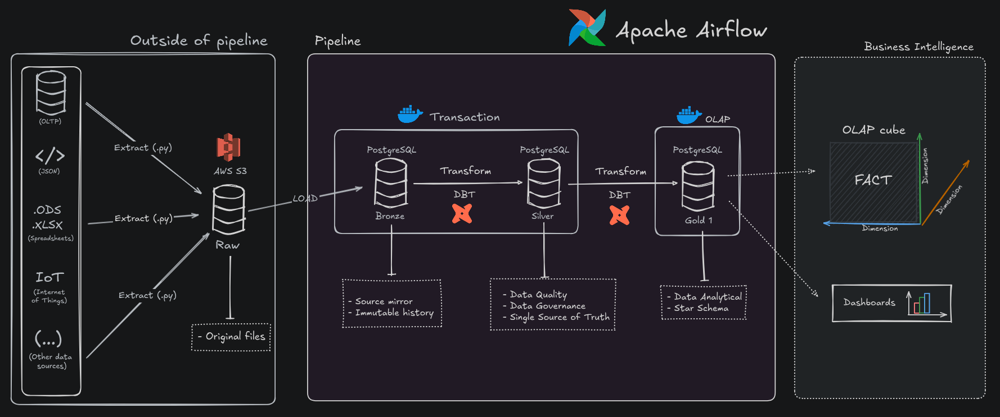

# 🚀 Pipeline de Dados ELT com Airflow, dbt e PostgreSQL

Este projeto implementa uma pipeline de dados ELT (Extract, Load, Transform) completa, utilizando ferramentas modernas de engenharia de dados. O objetivo é demonstrar a construção de um fluxo de dados robusto e automatizado, desde a ingestão de dados brutos de uma fonte externa (AWS S3) até a criação de modelos analíticos prontos para consumo em ferramentas de Business Intelligence.

O case de negócio utilizado é o [dataset público da Olist](https://www.kaggle.com/datasets/olistbr/brazilian-ecommerce), que contém dados de um e-commerce brasileiro. Os arquivos CSV deste dataset foram previamente carregados em um bucket S3, de onde a pipeline inicia seu processo.

## 🏛️ Arquitetura da Pipeline

A pipeline segue o padrão da **Medallion Architecture**, garantindo governança, qualidade e rastreabilidade dos dados em cada etapa do processo.


*(Modelado por Felipe Zandonadi)*

1.  **Ingestão (Raw):** Uma DAG do Airflow ingere os arquivos CSV do AWS S3 para uma schema `raw` no PostgreSQL, mantendo os dados em seu formato original.
2.  **Camada Bronze:** Os dados da camada `raw` são espelhados em tabelas na camada Bronze. Esta camada serve como um registro histórico e imutável dos dados de origem, com transformações mínimas.
3.  **Camada Silver:** Os dados são limpos, padronizados, tipados e enriquecidos. Regras de qualidade de dados e relacionamentos de integridade são aplicados, criando uma Fonte Única da Verdade (Single Source of Truth).
4.  **Camada Gold:** Os dados da camada Silver são agregados e modelados em um esquema dimensional (Star Schema), com tabelas fato e dimensões, otimizados para consultas analíticas e consumo por ferramentas de BI.

---

## 🛠️ Stack de Tecnologias

| Ferramenta | Finalidade |
| :--- | :--- |
| **Apache Airflow** | Orquestração e agendamento dos workflows. |
| **Astro CLI** | Ferramenta de linha de comando para executar e gerenciar um ambiente Airflow localmente. |
| **dbt (Data Build Tool)** | Ferramenta para realizar as transformações de dados (camadas Bronze, Silver, Gold). |
| **Cosmos** | Biblioteca Python para gerar DAGs e Tasks do Airflow dinamicamente a partir de projetos dbt. |
| **PostgreSQL** | RDBMS utilizado como Data Warehouse para armazenar as camadas de dados. |
| **Docker** | Plataforma para criar, implantar e executar os serviços (Airflow, Postgres) em contêineres. |
| **AWS S3** | Serviço de armazenamento de objetos utilizado como fonte dos dados brutos (Raw). |

## ⚙️ Pré-requisitos

Antes de começar, garanta que você tenha as seguintes ferramentas instaladas:

* **Docker e Docker Compose:** Essencial para criar e gerenciar os contêineres dos serviços.
    * *(Link para a documentação de instalação do Docker: [install doc](https://docs.docker.com/get-docker/) )*
* **Astro CLI:** A ferramenta de linha de comando oficial da Astronomer para desenvolvimento com Airflow.
    * *(Link para a documentação de instalação do Astro CLI: [install doc](https://docs.astronomer.io/astro/cli/install-cli) )*
* **Credenciais da AWS:** Você precisará de um `Access Key ID` e um `Secret Access Key` de um usuário IAM com permissão de leitura (`s3:GetObject`) no bucket S3 onde os dados da Olist estão armazenados.
    * *(Link para artigo no Medium sobre como criar credenciais da AWS: [Artigo](https://medium.com/@deepamathan/step-by-step-guide-to-generate-aws-security-credentials-8c0b433e5de6) )*

## 🚀 Guia de Instalação e Execução

Siga os passos abaixo para colocar a pipeline no ar em sua máquina local.

### 1. Clonar o Repositório

```bash
git clone https://github.com/FelipeZandonadi/data-pipeline_dbt-airflow-postgres.git
cd seu-repositorio
```

### 2. Configurar Variáveis de Ambiente

Este projeto utiliza um arquivo `.env` para gerenciar todas as credenciais de forma segura. Crie um arquivo chamado `.env` na raiz do projeto com o seguinte conteúdo:

```yaml
# Credenciais do Banco de Dados PostgreSQL
# Estes valores serão usados pelo docker-compose para iniciar o banco
POSTGRES_USER=seu_usuario_postgres
POSTGRES_PASSWORD=sua_senha_segura
POSTGRES_DB=lakehouse
POSTGRES_PORT=seu_bind
```

**Importante**: Os valores definidos aqui serão utilizados pelo `docker-compose.yml` para iniciar o contêiner do PostgreSQL e precisam corresponder às conexões que serão configuradas no Airflow.

Também será utilizado `airflow_settings.yml`. Arquivo reponsável por determinar as configurações básicas do Airflow.

```yaml
airflow:
  connections:
    - conn_id: postgres_conn
      conn_type postgres
      conn_host: <ip>
      conn_schema:
      conn_login: <POSTGRES_USER>
      conn_password: <POSTGRES_PASSWORD>
      conn_port: <POSTGRES_PORT>
```

Por padrão, o arquivo `.yaml` de configurações do airflow não tem suporte para realizar o bind com as variáveis de ambiente do arquivo `.env`, potanto, configure o valor das variáveis do `airflow_setings.yaml` iguais as das variáveis `.env`.

### 3. Iniciar os Serviços
Com o Docker em execução na sua máquina, inicialize a instância do Postgres e utilize o Astro CLI para iniciar todo o ambiente:

```bash
docker compose up -d
astro dev start
```
*(pode ser necessário super user)*

Estes comandos fará o seguinte:

- Construirá a imagem Docker customizada com as dependências do Airflow e dbt (definidas no `Dockerfile`).
- Iniciará os contêineres do Airflow (webserver, scheduler, etc.).
- Iniciará o contêiner do PostgreSQL, conforme definido no `docker-compose.yml`.

### 4. Configurar Conexões no Airflow
Após o `astro dev start` ser concluído, a interface do Airflow estará disponível.

1. Abra seu navegador e acesse `http://localhost:8080`.
1. Faça login com `admin` / `admin`.
1. Vá para a seção **Admin -> Connections**.
1. Crie as seguintes conexões:

- **Conexão AWS**:  
  - **Conn ID**: `aws`  
  - **Conn Type**: `Amazon Web Services`  
  - **AWS Access Key ID**: Cole o valor de `AWS_ACCESS_KEY_ID` do usuário IAM.  
  - **AWS Secret Access Key**: Cole o valor de `AWS_SECRET_ACCESS_KEY` do usuário IAM.  

- **Conexão Postgres (para dados Raw)**:  
  - **Conn ID**: `postgres_conn_raw`  
  - **Conn Type**: `PostgreSQL`  
  - **Host**: `postgres` (nome do serviço no Docker Compose)  
  - **Schema**: `lakehouse`  
  - **Login**: Cole o valor de `POSTGRES_USER` do seu `.env`.  
  - **Password**: Cole o valor de `POSTGRES_PASSWORD` do seu `.env`.  
  - **Port**: `5432`  

5. Executando a Pipeline
Com as conexões configuradas, você está pronto para executar a pipeline. Vá para a página de DAGs na interface do Airflow.

A execução deve seguir a ordem lógica das camadas:

1. `ingestion_S3_to_postgres`: Ative esta DAG e dispare uma execução manual. Aguarde a conclusão. Ela irá popular o schema `raw` no banco de dados.
1. `dag_brz`: Após a ingestão, execute esta DAG para processar a camada Bronze.
1. `dag_slv`: Após a Bronze, execute esta DAG para processar a camada Silver.
1. `dag_gld`: Por fim, execute esta DAG para criar os modelos analíticos na camada Gold.

Após a execução de todas as DAGs, você pode se conectar ao banco de dados PostgreSQL e explorar as tabelas nas schemas `raw`, `brz_data`, `slv_data` e `gld_data` para verificar os resultados.
